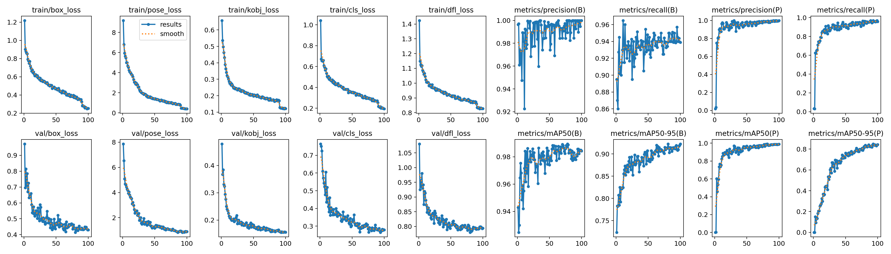
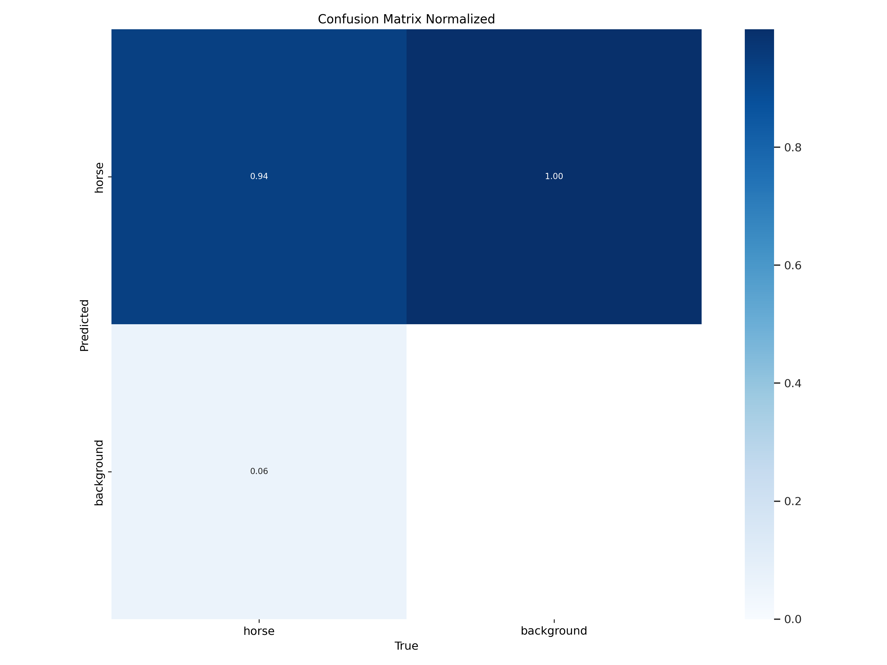

# 🐎 HorsePose-YOLOv8 🐎

## 📋 Overview

This repository contains the implementation of a horse pose estimation project using the **YOLOv8n-pose** model. The project focuses on fine-tuning the model for horse keypoint detection using the Horse-10 dataset. It includes data preprocessing, model training, evaluation, and real-time inference on video data.

**👥Presented by:** 

🧑‍💻 Iheb Alimi  
👨‍💻 Riadh Ibrahim

---

## 🛠️ Requirements

- Python 3.9+ 🐍
- Ultralytics YOLOv8 🤖
- PyTorch 2.6.0+ (with CUDA support recommended) 🔥
- NumPy, Pandas, Matplotlib, Seaborn, WordCloud, OpenCV 📚
- GPU: Tesla T4 or equivalent 🖥️ (Google Colab is a highly recommended environment)

---

## 📊 Dataset

- **Dataset**: Horse-10 🐴  
- **Total Images**: 8,114 📸  
- **Subdirectories**: 30 (e.g., `ChestnutHorseLight`, `BrownHorseInShadow`) 📂  
- **Keypoints**: 22 body parts (e.g., Nose, Eye, Shoulder, Hip) 📍  
- **Annotation Completeness**: Most images have 10–22 valid keypoints, peaking at ~3,000 images with 20 keypoints 📊  
- **Source**: [Horse-10 GitHub Repo](https://github.com/alimiheb/horse10.git) 🔗  

---

## 💻 Code Structure

Main notebook: `fine-tuning of YOLOv8-pose for APE(1).ipynb` 📓

Includes:
- Cloning Horse-10 dataset 📥
- Installing dependencies (Ultralytics, Seaborn, WordCloud) 🛠️
- Importing libraries (Pandas, Matplotlib, OpenCV) 📚
- Displaying sample inference via GIF 🎞️
- Environment: Python 3.9.19, PyTorch 2.6.0+cu124, GPU support 🐍

---

## 📈 Model Evaluation

The YOLOv8n-pose model was evaluated on a validation set of 200 images:

- **Box mAP@50**: 0.984  
- **Box mAP@50–95**: 0.921 (Precision: 1.0, Recall: 0.939) ✅  
- **Pose mAP@50**: 0.988  
- **Pose mAP@50–95**: 0.844 (Precision: 1.0, Recall: 0.957) 📍  
- **Inference Speed**: 3.3ms per image on Tesla T4 GPU ⚡  
- **Hardware**: CUDA:0 (Tesla T4, 15095MiB) 🖥️  

> The model performs excellently in bounding box detection and shows good keypoint estimation, with some loss in precision at stricter thresholds due to occlusion or uneven distribution. 📉

### 📊 Evaluation Metrics

---

## 🎨 Visualizations

Sample inference is shown via `horse.gif`, demonstrating real-time keypoint detection on horse video footage. 🎞️

---

